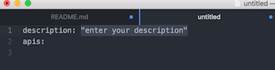

# anypoint-deployer package

A package to help Atom users create  Anypoint Platform Deployment YAMLs

## Transform to sublime completition

 1. Follow [these](https://packagecontrol.io/packages/Atomizr)instructions to install Atomizr.
 2. Copy the generated completition source into Sublime package directory (Sublime Text > Preferences > Browse Packagess...)
 3. Restart sublime

 ## Usage:

 1. Type start-api-spec

 2. Add api-entry(s):
 
 
   
